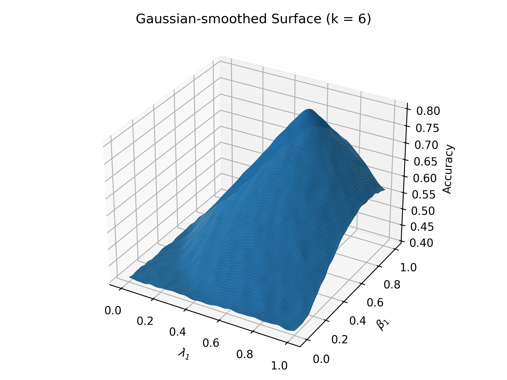
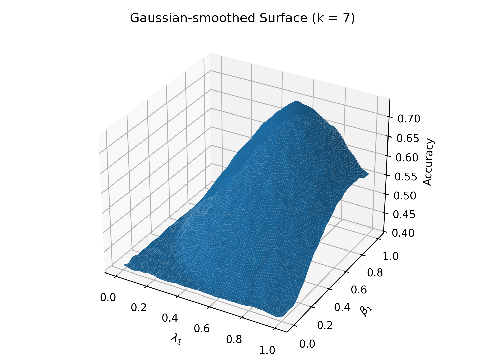
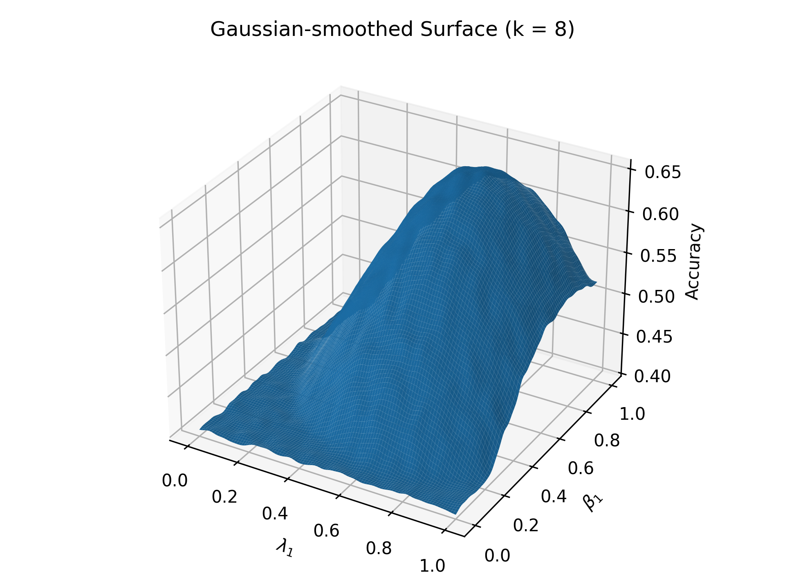

<p align="center">
  <a href="">
    
  </a>
</p>

MetaMind is a novel multi-agent framework designed to endow Large Language Models (LLMs) with more human-like social reasoning capabilities. Traditional LLMs often struggle with the ambiguity and indirectness inherent in real-world human communication, failing to grasp unspoken intents, implied emotions, or culturally sensitive cues. MetaMind addresses this gap by explicitly modeling the multi-stage cognitive processes humans use to reason about unobservable mental states and navigate socially complex environments.

Inspired by psychological theories of metacognition and Theory of Mind (ToM), MetaMind employs a staged and collaborative system of three specialized agents to interpret, refine, and respond to social interactions with greater nuance, empathy, and cultural sensitivity.

> *“What is meant often goes far beyond what is said, and that is what makes conversation possible.”* - H. P. Grice

## Key Features & Core Concepts

MetaMind's architecture is built upon a layered reasoning process involving three distinct agents:

1.  **Theory-of-Mind (ToM) Agent**: This agent initiates the reasoning process by generating multiple hypotheses about the user's latent mental state (beliefs, desires, intentions, emotions, thoughts) based on contextual and social cues. It aims to move beyond literal interpretations to infer what the speaker might be truly trying to convey.
    *   **Hypothesis Generation**: Produces a set of candidate mental state interpretations with explanations and type labels.
    *   **Mental-State Reasoning**: Involves commonsense-based hypothesis generation, cross-referencing with social memory, identifying ToM markers, and diversifying hypotheses.

2.  **Domain Agent**: This agent refines the hypotheses generated by the ToM Agent by incorporating socially grounded constraints. It assesses the appropriateness of interpretations against broader norms like cultural expectations, ethical guidelines, and situational context, ensuring socially responsible and domain-aware reasoning.
    *   **Hypothesis Refinement and Selection**: Revises hypotheses based on domain rules (cultural, ethical, role-based) and selects the most appropriate one using a scoring mechanism that balances contextual plausibility and information gain.

3.  **Response Agent**: This agent generates a contextually appropriate output based on the refined optimal hypothesis and the user's social memory (e.g., emotional patterns, prior preferences). It also includes a self-validation mechanism to ensure the response aligns with the inferred intent and maintains social and semantic quality.
    *   **Generation and Validation**: Produces a natural language response conditioned on the selected hypothesis and social memory, then validates it for empathy and coherence.

## Methodology

The MetaMind framework operates in a staged metacognitive loop:

1.  **Stage 1: Generating Mental State Hypotheses (ToM Agent)**
    *   Analyzes user input and conversational context.
    *   Integrates information from a social memory module (storing user preferences and emotional markers).
    *   Classifies potential mental states (Belief, Desire, Intention, Emotion, Thought).
    *   Generates a diverse set of k candidate hypotheses.

2.  **Stage 2: Refining Hypotheses (Domain Agent)**
    *   Applies domain-specific rules (cultural, ethical, role-based) to revise each hypothesis.
    *   Selects the optimal revised hypothesis based on contextual plausibility and information gain.

3.  **Stage 3: Generating and Validating Output (Response Agent)**
    *   Generates a response conditioned on the selected hypothesis and social memory.
    *   Self-validates the response for emotional alignment (empathy) and contextual coherence.

## Theoretical Grounding

MetaMind is grounded in established psychological theories:

*   **Theory of Mind (ToM)**: The human capacity to attribute mental states—beliefs, desires, intentions, emotions—to oneself and to others, and to understand that others have beliefs, desires, intentions, and perspectives that are different from one's own.
*   **Metacognition**: Awareness and understanding of one's own thought processes. MetaMind mirrors this by reflecting on, revising, and adapting its understanding in light of social norms and constraints.

## 📊 Datasets and Metrics

MetaMind's performance is evaluated on a diverse set of challenging benchmarks that cover various aspects of social reasoning:

1.  **ToMBench**: 
    *   **Description**: A multiple-choice benchmark designed to test Theory-of-Mind (ToM) reasoning across six key dimensions: `Emotion`, `Desire`, `Intention`, `Knowledge`, `Belief`, and `Natural Language Communication`.
    *   **Alignment**: Primarily evaluates the capabilities of the **ToM Agent (Stage 1)** in generating structured mental state hypotheses.
    *   **Metric**: Accuracy.

2.  **Social Cognition Tasks**:
    *   **Description**: A suite of tasks from ToMBench that probe context-sensitive reasoning under social, cultural, and ethical norms. This includes eight real-world tasks such as Faux Pas Recognition Test (FRT), Scalar Implicature Test (SIT), and the Ambiguous Story Task (AST).
    *   **Alignment**: Assesses the **Domain Agent's (Stage 2)** ability to refine interpretations based on domain-specific constraints.
    *   **Metric**: Accuracy, Average Improvement over baselines.

3.  **Social Tasks in Sandbox Simulation (STSS)**:
    *   **Description**: A benchmark testing goal-oriented social interaction in open-ended, interactive scenarios across six domains: `Conversation`, `Public Activity`, `Appointment`, `Inviting Companions`, `Online Activity`, and `Asking for Help`.
    *   **Alignment**: Tests the **Response Agent's (Stage 3)** capacity to generate contextually appropriate and validated responses.
    *   **Metric**: Average Score.

## 🧪 Experimental Results

MetaMind demonstrates significant improvements over baseline LLMs and existing methods across all evaluated benchmarks. Here are some highlights:

### Performance on Theory-of-Mind Reasoning (ToMBench)

MetaMind consistently boosts ToM reasoning capabilities across various LLMs, including both proprietary models like GPT-4 and open-source alternatives. For instance, MetaMind-enhanced GPT-4 achieves an average accuracy of **81.0%** on ToMBench, a notable improvement from the base GPT-4's 74.8%.

**Table: Comparison on Theory-of-Mind reasoning task (ToMBench - Accuracy %)**

| Model                       | Emotion | Desire | Intention | Knowledge | Belief | NL Comm. | AVG.  |
|-----------------------------|---------|--------|-----------|-----------|--------|----------|-------|
| Base (GPT-4)                | 75.7    | 69.7   | 84.7      | 52.1      | 82.8   | 84.0     | 74.8  |
| w. CoT                      | 73.2    | 63.3   | 77.9      | 60.4      | 83.6   | 83.0     | 73.6  |
| w. HM                       | 76.4    | 71.1   | 80.2      | 59.3      | 84.1   | 85.0     | 76.0  |
| w. ToM2C                    | 77.2    | 70.4   | 81.5      | 57.8      | 85.3   | 84.6     | 76.1  |
| w. Generative Agents        | 74.8    | 72.0   | 78.9      | 55.6      | 83.2   | 86.4     | 75.1  |
| w. SymbolicToM              | 75.9    | 70.9   | 79.6      | 58.2      | 84.0   | 83.7     | 75.4  |
| **w. MetaMind (ours)**      | **78.7**| **76.5**| 84.3      | **68.2**  | **88.6**| **88.5** | **81.0**|

### Ablation Study: The Importance of Each Stage

An ablation study was conducted on the STSS benchmark to validate the contribution of each stage in the MetaMind framework. Removing any stage leads to a noticeable degradation in performance, underscoring the importance of the layered cognitive architecture.

**Table: Ablation study on STSS (Average Score %)**

| Configuration         | Conv. | Pub. Act. | Appo. | Inv. Com. | Online Act. | Help   | Avg.   |
|-----------------------|-------|-----------|-------|-----------|-------------|--------|--------|
| **MetaMind**          | **80.8**| **81.9**  | **65.0**| **67.1**  | **75.1**    | **73.0**| **73.9** |
| w/o Stage 1 (ToM)     | 78.1  | 78.4      | 59.0  | 60.3      | 72.1        | 62.3   | 68.3   |
| w/o Stage 2 (Domain)  | 79.2  | 79.3      | 61.7  | 62.2      | 73.7        | 67.0   | 70.5   |
| w/o Stage 3 (Response)| 58.7  | 67.2      | 54.2  | 43.2      | 61.9        | 61.7   | 57.8   |
| w/o SocialMemory      | 70.5  | 72.3      | 57.0  | 58.0      | 64.8        | 61.2   | 63.9   |

*   **Stage 1 (Mental-State Reasoning)**: Removing structured mental-state reasoning leads to an average drop, particularly in high-ambiguity tasks.
*   **Stage 2 (Norm-Aware Refinement)**: Removing domain-specific rule refinement results in a substantial performance drop, especially in tasks requiring pragmatic interpretation or adherence to social norms.
*   **Stage 3 (Response via Validation)**: Bypassing response validation significantly impacts overall performance, highlighting the criticality of this final step for high-quality, appropriate responses.

### Parameter Sensitivity and Further Details

Sensitivity analyses for key hyperparameters (`k` for hypothesis count, `λ` for Domain Agent trade-off, `β` for Response Agent trade-off) are detailed in the appendix of the full paper. These analyses confirm the robustness of MetaMind's performance across a range of parameter settings.

Below are visualizations illustrating the parameter sensitivity for the number of hypotheses (k) in the ToM Agent. These surfaces show how performance (average score on TomBench) varies with changes in `λ` (Domain Agent) and `β` (Response Agent) for different values of `k`.

<table>
  <tr>
    <td align="center">Parameter Sensitivity for k=6</td>
    <td align="center">Parameter Sensitivity for k=7</td>
    <td align="center">Parameter Sensitivity for k=8</td>
  </tr>
  <tr>
    <td align="center"></td>
    <td align="center"></td>
    <td align="center"></td>
  </tr>
</table>

These plots help in understanding the interplay between different parameters and selecting optimal values for `k`, `λ`, and `β` to achieve the best performance.

For more detailed experimental setups, results on additional benchmarks, and qualitative case studies, please refer to the full research paper.

## Running the Project

Follow these steps to get MetaMind up and running on your local machine.

### 1. Clone the Repository

First, clone the MetaMind repository to your local system using Git:

```bash
git clone <repository-url> # Replace <repository-url> with the actual URL of your Git repository
cd MetaMind
```

### 2. Setup and Configuration

It's recommended to set up a virtual environment for Python projects.

```bash
python -m venv venv
# On Windows
.\venv\Scripts\activate
# On macOS/Linux
source venv/bin/activate
```

Install the required dependencies:

```bash
pip install -r requirements.txt
```

Configure the project by editing the `config.py`file. This file likely contains settings for API keys, model parameters, or other essential configurations. Please refer to the comments within `config.py` for specific instructions on what to set.

### ⚙️ Configuration

Before running the project, you need to configure the settings in the `config.py` file. This file contains crucial parameters for the LLM API, agent behaviors, and social memory.

**Important**: You MUST replace the placeholder values in `config.py` with your actual credentials and desired settings. Specifically, pay attention to the `api_key` and `base_url` for the LLM.

Here's an overview of the key configurable parameters in `config.py`:

| Category             | Parameter             | Description                                                                 | Default Value        |
|----------------------|-----------------------|-----------------------------------------------------------------------------|----------------------|
| **LLM API Settings** | `api_key`             | Your API key for the LLM service (e.g., OpenAI).                            | `"your-openai-key"`  |
|                      | `base_url`            | The base URL for the LLM API (if using a custom or self-hosted endpoint). | `"your-openai-url"`  |
|                      | `model_name`          | The specific LLM model to use (e.g., "gpt-4o").                             | `"gpt-4o"`           |
|                      | `temperature`         | Controls the randomness of the LLM's output.                                | `0.7`                |
|                      | `max_tokens`          | The maximum number of tokens the LLM can generate in a single response.     | `1000`               |
| **ToM Agent**        | `hypothesis_count`    | Number of mental state hypotheses to generate.                              | `7`                  |
|                      | `target_diversity`    | Desired diversity score among generated hypotheses.                         | `0.4`                |
|                      | `evidence_threshold`  | Minimum evidence level required for a hypothesis.                           | `"medium-high"`      |
| **Domain Agent**     | `lambda`              | Weight for balancing prior and conditional probabilities in hypothesis scoring. | `0.7`                |
|                      | `epsilon`             | Small constant to avoid log(0) errors.                                      | `1e-10`              |
| **Response Agent**   | `beta`                | Trade-off weight between empathy and coherence in response generation.      | `0.8`                |
|                      | `utility_threshold`   | Minimum utility score for an acceptable response before revision.           | `0.9`                |
|                      | `max_revisions`       | Maximum number of revisions for a response if below utility threshold.      | `3`                  |
| **Social Memory**    | `memory_decay_rate`   | Rate at which the importance of memory items decays over time.              | `0.05`               |
|                      | `max_memory_items`    | Maximum number of items to store in the social memory.                      | `100`                |

Make sure to review and update these settings in `config.py` according to your needs and API access.

### 3. Running the Terminal Version

To run the terminal-based version of MetaMind, execute the `main.py` script:

```bash
python main.py
```

This will typically start an interactive command-line interface where you can interact with the MetaMind agents.

### 4. Running the Web Version

To run the web-based interface for MetaMind (if available), execute the `app.py` script:

```bash
python app.py
```

This will usually start a local web server. Open your web browser and navigate to the URL provided in the terminal output (commonly `http://127.0.0.1:5000` or similar).
